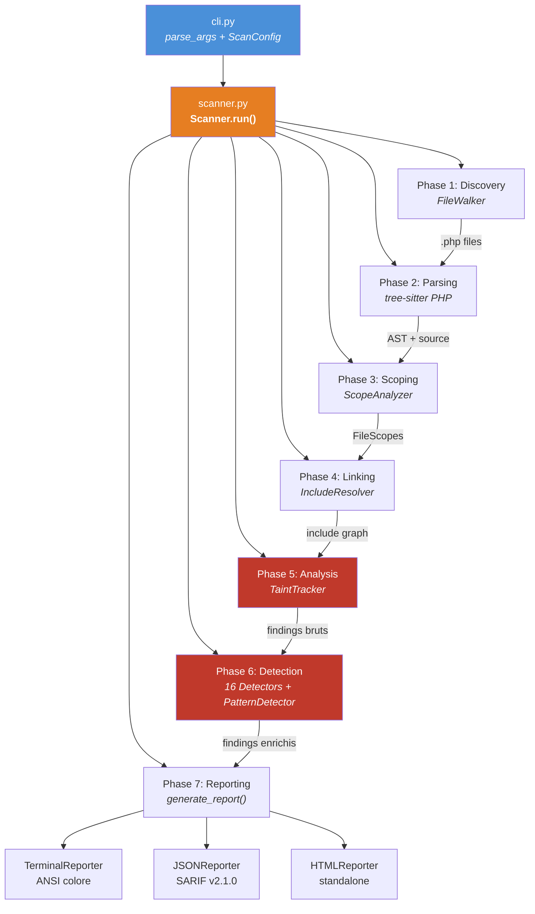
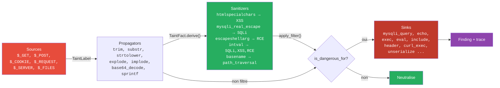

# Python.PHP.Whitebox - Analyseur Statique de Securite PHP (White-Box)

Outil Python d'analyse statique hybride pour projets PHP : taint tracking avance, detection de 16+ types de vulnerabilites, reporting multi-format.

## Quick Start

```bash
# Installation
pip install -r requirements.txt

# Scan basique (output terminal)
python3 -m cli /var/www/monprojet/

# Scan cible avec filtre
python3 -m cli /var/www/monprojet/ --vuln-types sql_injection xss rce

# Rapport JSON
python3 -m cli /var/www/monprojet/ --format json -o report.json

# Rapport HTML
python3 -m cli /var/www/monprojet/ --format html -o report.html

# Filtrer par severite
python3 -m cli /var/www/monprojet/ --severity-min high --format terminal
```

## Fonctionnalites

- **Parcours recursif** du projet pour trouver tous les fichiers PHP
- **Parsing AST** avec Tree-sitter pour une analyse precise du code
- **Taint tracking avance** : suivi de la propagation des entrees utilisateur (`$_GET`, `$_POST`, etc.) vers les sinks dangereux
- **16 types de vulnerabilites** detectes avec mapping CWE/OWASP
- **Sanitizers contextuels** : `htmlspecialchars` neutralise XSS mais pas SQLi
- **Analyse inter-fichiers** : suivi du taint a travers les `include`/`require`
- **Reporting multi-format** : terminal colore, JSON (SARIF), HTML
- **Trace de flux complet** : source -> intermediaires -> sink

## Vulnerabilites Detectees

| Type | CWE | Severite | Description |
|------|-----|----------|-------------|
| SQL Injection | CWE-89 | Critical | Donnees utilisateur dans les requetes SQL |
| XSS | CWE-79 | High | Donnees utilisateur dans la sortie HTML |
| RCE / Command Injection | CWE-78 | Critical | Donnees utilisateur dans les commandes systeme |
| Code Injection | CWE-94 | Critical | Fonctions d'execution de code dynamique |
| File Inclusion (LFI/RFI) | CWE-98 | Critical | include/require avec chemin utilisateur |
| Path Traversal | CWE-22 | High | Acces fichiers avec chemin utilisateur |
| Insecure Upload | CWE-434 | High | Upload sans validation |
| Insecure Deserialization | CWE-502 | Critical | unserialize() avec donnees utilisateur |
| SSRF | CWE-918 | High | Requetes serveur avec URL utilisateur |
| XXE | CWE-611 | High | Parsing XML sans protection entities |
| Open Redirect | CWE-601 | Medium | Redirect avec URL utilisateur |
| LDAP Injection | CWE-90 | High | Donnees utilisateur dans requetes LDAP |
| Crypto Weakness | CWE-327 | Medium | Algorithmes de hash faibles pour mots de passe |
| Hardcoded Secrets | CWE-798 | High | Credentials en dur dans le code |
| Session Fixation | CWE-384 | Medium | session_id() avec input utilisateur |
| Type Juggling | CWE-697 | Medium | Comparaison lache (==) en contexte auth |

## Architecture

### Pipeline de scan (7 phases)



### Diagramme des classes

```mermaid
classDiagram
    class Scanner {
        +ScanConfig config
        +run() ScanResult
    }

    class ScanConfig {
        +Path project_path
        +list vuln_types
        +str output_format
        +Severity severity_min
    }

    class RulesConfig {
        +list sources
        +dict filters
        +dict vulnerabilities
        +is_source(var) bool
        +get_sink_vuln(func) VulnRule
        +get_filter_info(func) FilterInfo
        +is_propagator(func) bool
    }

    class ScopeAnalyzer {
        +extract(tree, source, file_path) FileScopes
    }

    class IncludeResolver {
        +find_includes(tree, source, file_path) list
    }

    class TaintTracker {
        +str source_code
        +Tree tree
        +TaintState state
        +analyze() list~Finding~
        -_walk(node)
        -_evaluate_taint(node) TaintFact
        -_handle_assignment(node)
        -_handle_echo(node)
        -_handle_function_call(node)
        -_check_sink_args(node, func, rule, args)
    }

    class TaintState {
        +dict variables
        +clone() TaintState
        +merge(other) TaintState
        +set_taint(var, fact)
        +get_taint(var) TaintFact
    }

    class TaintFact {
        +set~TaintLabel~ labels
        +dict filters_applied
        +list~TraceStep~ trace
        +is_dangerous_for(vuln_type) bool
        +remaining_categories() set
        +apply_filter(name, neutralizes) TaintFact
        +derive(description, file, line) TaintFact
    }

    class TaintLabel {
        +str source_type
        +str source_var
        +str source_file
        +int source_line
        +frozenset vuln_categories
    }

    class CrossFileContext {
        +dict include_graph
        +dict exported_taint
        +dict function_summaries
        +topological_file_order(files) list
        +get_included_taint(file) dict
    }

    class PatternDetector {
        +scan_file(file_path, source) list~Finding~
    }

    class ContextAnalyzer {
        +refine_findings(findings, source) list~Finding~
    }

    class BaseDetector {
        <<abstract>>
        +str vuln_type
        +Severity default_severity
        +str cwe
        +detect(findings, file, source) list~Finding~
        +is_properly_sanitized(finding) bool
    }

    class Finding {
        +str vuln_type
        +Severity severity
        +Confidence confidence
        +str cwe
        +str file_path
        +int line
        +str sink_function
        +str source_variable
        +list~TraceStep~ data_flow
        +str fingerprint
    }

    class ScanResult {
        +list~Finding~ findings
        +ScanSummary summary
        +int files_scanned
        +float scan_duration_seconds
    }

    Scanner --> RulesConfig : charge
    Scanner --> ScopeAnalyzer : Phase 3
    Scanner --> IncludeResolver : Phase 4
    Scanner --> CrossFileContext : construit
    Scanner --> TaintTracker : Phase 5
    Scanner --> BaseDetector : Phase 6
    Scanner --> PatternDetector : Phase 6
    Scanner --> ContextAnalyzer : Phase 6
    Scanner --> ScanResult : produit

    TaintTracker --> TaintState : manipule
    TaintTracker --> CrossFileContext : consulte
    TaintState --> TaintFact : contient
    TaintFact --> TaintLabel : reference
    TaintTracker --> Finding : genere

    BaseDetector <|-- SQLInjectionDetector
    BaseDetector <|-- XSSDetector
    BaseDetector <|-- RCEDetector
    BaseDetector <|-- CodeInjectionDetector
    BaseDetector <|-- FileInclusionDetector
    BaseDetector <|-- PathTraversalDetector
    BaseDetector <|-- SSRFDetector
    BaseDetector <|-- XXEDetector
    BaseDetector <|-- OpenRedirectDetector
    BaseDetector <|-- LDAPInjectionDetector
    BaseDetector <|-- InsecureUploadDetector
    BaseDetector <|-- InsecureDeserializationDetector
    BaseDetector <|-- CryptoWeaknessDetector
    BaseDetector <|-- HardcodedSecretsDetector
    BaseDetector <|-- SessionFixationDetector
    BaseDetector <|-- TypeJugglingDetector
```



### Flux du taint tracking



## Structure du Projet

```
Python.PHP.Whitebox/
  cli.py                            # Point d'entree CLI
  scanner.py                        # Orchestrateur du pipeline

  parser/
    php_parser.py                   # Parser Tree-sitter PHP (encodage resilient)
    scope_analyzer.py               # Extraction fonctions/classes/methodes
    include_resolver.py             # Resolution des include/require

  analysis/
    taint_state.py                  # Structures de donnees taint (TaintFact, TaintState, TraceStep)
    taint_tracker.py                # Moteur de taint analysis intra-procedural
    cross_file_context.py           # Contexte global inter-fichiers
    pattern_detector.py             # Detection par regex (secrets, crypto, configs)
    context_analyzer.py             # Suppression faux positifs contextuels

  detectors/
    __init__.py                     # Registre des detecteurs
    base.py                         # BaseDetector ABC
    sql_injection.py                # SQL Injection (CWE-89)
    xss.py                          # Cross-Site Scripting (CWE-79)
    rce.py                          # Remote Code Execution (CWE-78)
    code_injection.py               # Code Injection (CWE-94)
    file_inclusion.py               # File Inclusion LFI/RFI (CWE-98)
    path_traversal.py               # Path Traversal (CWE-22)
    insecure_upload.py              # Insecure Upload (CWE-434)
    insecure_deserialization.py     # Insecure Deserialization (CWE-502)
    ssrf.py                         # SSRF (CWE-918)
    xxe.py                          # XXE (CWE-611)
    open_redirect.py                # Open Redirect (CWE-601)
    ldap_injection.py               # LDAP Injection (CWE-90)
    crypto_weakness.py              # Weak Cryptography (CWE-327)
    hardcoded_secrets.py            # Hardcoded Secrets (CWE-798)
    session_fixation.py             # Session Fixation (CWE-384)
    type_juggling.py                # Type Juggling (CWE-697)

  config/
    schema.py                       # Enums (Severity, Confidence) + dataclasses config
    loader.py                       # Chargement + validation rules.yaml
    rules.yaml                      # Regles de detection (sources, sinks, sanitizers, patterns)

  report/
    __init__.py                     # generate_report() dispatch
    finding.py                      # Finding, ScanResult, ScanSummary dataclasses
    baseline.py                     # Comparaison avec scan precedent
    json_reporter.py                # JSON / SARIF v2.1.0 output
    html_reporter.py                # HTML standalone (CSS/JS inline)
    terminal_reporter.py            # Terminal ANSI colore

  utils/
    filewalker.py                   # Recherche recursive de fichiers PHP
    text.py                         # Extraction texte depuis noeuds AST
    ast_helpers.py                  # Helpers de navigation AST
    progress.py                     # Barre de progression

  tests/
    conftest.py                     # Fixtures pytest
    php_samples/                    # Fichiers PHP de test (26)
    unit/                           # Tests unitaires
    integration/                    # Tests end-to-end
```

## Options CLI

```
usage: Python.PHP.Whitebox [-h] [--vuln-types TYPE [TYPE ...]] [--format {terminal,json,html,sarif}]
                  [-o OUTPUT] [--severity-min {info,low,medium,high,critical}]
                  [--exclude PATTERN [PATTERN ...]] [--config PATH]
                  [--baseline PATH] [--no-color] [-v | -q]
                  path

Arguments:
  path                          Chemin vers le projet PHP

Options:
  --vuln-types TYPE [TYPE ...]  Types de vulnerabilites a scanner (defaut: tous)
  --format {terminal,json,html,sarif}  Format de sortie (defaut: terminal)
  -o, --output OUTPUT           Fichier de sortie
  --severity-min LEVEL          Severite minimale a reporter (defaut: info)
  --exclude PATTERN [PATTERN ...]  Patterns d'exclusion (ex: vendor/* tests/*)
  --config PATH                 Fichier de regles custom
  --baseline PATH               Scan precedent pour comparaison (nouveaux findings uniquement)
  --no-color                    Desactiver les couleurs
  -v, --verbose                 Mode verbeux
  -q, --quiet                   Mode silencieux
```

## Moteur de Taint Analysis

Le coeur du scanner est un moteur de **taint tracking** qui suit la propagation des donnees utilisateur a travers le code PHP :

### Sources (entrees utilisateur)
`$_GET`, `$_POST`, `$_COOKIE`, `$_REQUEST`, `$_SERVER`, `$_FILES`, `$_ENV`

### Propagation suivie
- Assignations : `$x = $_GET['id']` -> `$x` est tainted
- Concatenation : `$q = "SELECT " . $x` -> `$q` est tainted
- Interpolation : `"Hello $x"` -> tainted si `$x` l'est
- Acces tableaux : `$_GET['key']`, `$data['id']`
- Retours fonctions : suivi inter-procedural
- Casts : `(int)$x` agit comme sanitizer, `(string)$x` propage le taint

### Sanitizers contextuels
- `htmlspecialchars()` -> neutralise XSS uniquement
- `mysqli_real_escape_string()` -> neutralise SQLi uniquement
- `escapeshellarg()` -> neutralise RCE uniquement
- `intval()` / `(int)` -> neutralise SQLi, XSS, RCE, path traversal
- `basename()` -> neutralise path traversal et file inclusion

### Flux de controle
- **if/else** : clone l'etat, analyse les deux branches, merge (union conservatif)
- **boucles** : 2 iterations pour capturer le taint loop-carried
- **foreach** : propage le taint de la source vers la variable d'iteration

## Dependances

```
tree-sitter~=0.24.0
tree-sitter-php~=0.23.11
PyYAML~=6.0.2
```

---

## Tests

Le projet inclut 26 fichiers PHP de test couvrant les 16 types de vulnerabilites, plus des variantes (sanitized, multi-step, cross-function, conditional, foreach).

```bash
# Lancer tous les tests (64 tests)
python3 -m pytest tests/ -v

# Tests unitaires uniquement
python3 -m pytest tests/unit/ -v

# Tests d'integration end-to-end
python3 -m pytest tests/integration/ -v
```

### Fichiers de test PHP

| Fichier | Description |
|---------|-------------|
| `sqli_direct.php` | SQL injection directe |
| `sqli_sanitized.php` | SQLi neutralisee (0 finding attendu) |
| `sqli_multistep.php` | SQLi avec propagation multi-etapes |
| `xss_direct.php` | XSS directe |
| `xss_sanitized.php` | XSS neutralisee (0 finding attendu) |
| `xss_concatenation.php` | XSS via concatenation de strings |
| `rce_direct.php` | Command injection directe |
| `rce_sanitized.php` | RCE neutralisee (0 finding attendu) |
| `code_injection.php` | eval() avec donnees utilisateur |
| `file_inclusion.php` | include/require avec chemin utilisateur |
| `path_traversal.php` | Acces fichiers avec chemin tainted |
| `insecure_upload.php` | Upload sans validation |
| `insecure_deserialization.php` | unserialize() avec input utilisateur |
| `ssrf.php` | Requetes HTTP avec URL utilisateur |
| `xxe.php` | Parsing XML sans protection |
| `open_redirect.php` | Redirect vers URL utilisateur |
| `ldap_injection.php` | Requetes LDAP avec input utilisateur |
| `session_fixation.php` | session_id() avec input utilisateur |
| `type_juggling.php` | Comparaison lache en contexte auth |
| `hardcoded_secrets.php` | Credentials en dur |
| `crypto_weakness.php` | Hash faibles pour mots de passe |
| `false_positive_clean.php` | Code propre (0 finding attendu) |
| `mixed_vulns.php` | Multiples types dans un fichier |
| `cross_function.php` | Taint a travers les appels de fonctions |
| `foreach_taint.php` | Propagation dans les boucles foreach |
| `conditional_taint.php` | Taint dans les branches if/else |

## Stack

[](https://skillicons.dev)
